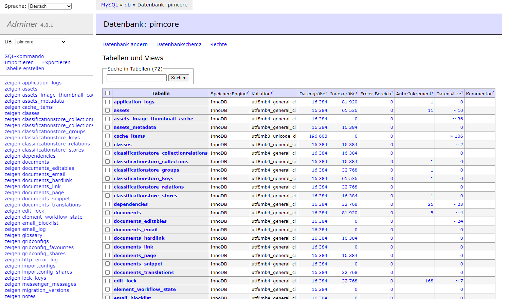
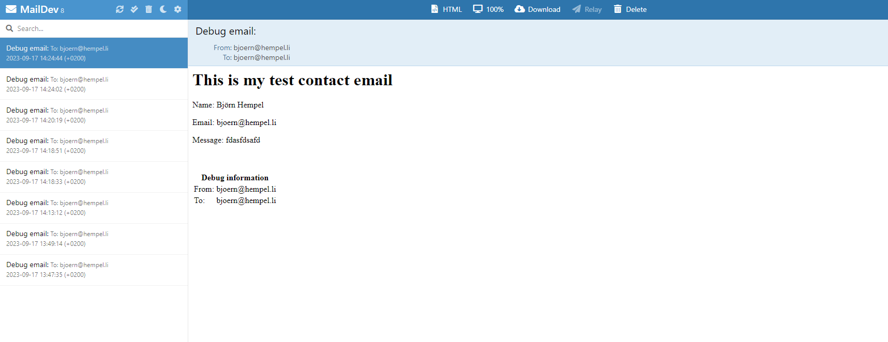

# Pimcore - www.hempel.li

[](https://github.com/bjoern-hempel/pimcore-hempel-li/releases)
[](https://www.php.net/supported-versions.php)
[](https://phpstan.org/user-guide/rule-levels)
[](https://www.php-fig.org/psr/psr-12/)
[](https://phpunit.de/)
[](https://phpmd.org/rules/index.html)
[](https://getrector.org/)
[](https://github.com/bjoern-hempel/pimcore-hempel-li/blob/master/LICENSE.md)

> The source code for [www.hempel.li](https://www.hempel.li).

## 1. Installation

```bash
git clone git@github.com:bjoern-hempel/pimcore-hempel-li.git && cd pimcore-hempel-li
```

### 1.1 Preparation / Needed applications locally

#### 1.1.1 mysql client

Most of the commands and services are executed within the docker compose setup. If you needs to import or create a
db fixtures you also need the mysql client

* `composer db:dump:main:sql`
* `composer db:restore:main:sql`

Check if this client is installed locally:

```bash
mysql -V
```

```text
mysql  Ver 15.1 Distrib 10.7.8-MariaDB, for debian-linux-gnu (x86_64) using readline 5.2
```

If it is not installed (Mac):

```bash
brew install mysql-client
echo 'export PATH="/usr/local/opt/mysql-client/bin:$PATH"' >> ~/.bash_profile
source ~/.bash_profile
```

### 1.2 Quick Start

> Recommended, but optional: It is recommended to install traefik first, if you want to use domain names instead of
> ports and to work in parallel with other projects:
> ([Local traefik proxy](https://github.com/bjoern-hempel/local-traefik-proxy))

#### 1.2.1 Add db credentials

See `docker-compose.yml` for current credentials:

```yaml
db:
    ...
    environment:
        - MYSQL_ROOT_PASSWORD=ROOT
        - MYSQL_DATABASE=pimcore
        - MYSQL_USER=<changeme>
        - MYSQL_PASSWORD=<changeme>
```

Add the same:

```bash
vi config/local/database.yaml
```

```bash
doctrine:
    dbal:
        connections:
            default:
                host: db
                port: '3306'
                user: <changeme>
                password: <changeme>
                dbname: pimcore
                mapping_types:
                    enum: string
                    bit: boolean
                server_version: '10.11.5-MariaDB-1:10.11.5+maria~ubu2204'
```

#### 1.2.2 Start docker

```bash
composer docker-composer:up
```

#### 1.2.3 Install dependencies

```bash
composer docker-composer:composer-install
```

#### 1.2.4 Import db fixtures

> **Hint**: Before you can use the following command, please add all the necessary sql files into this
> directory: `fixtures/db/.`. Alternatively you can use the installer command to install a new
> instance:
> 
> ```bash
> docker compose exec php vendor/bin/pimcore-install --mysql-host-socket=db --mysql-username=pimcore --mysql-password=pimcore --mysql-database=pimcore
>```

```bash
composer db:restore:main:sql
```

#### 1.2.5 Import assets

```bash
composer assets:restore
```

#### 1.2.6 Create necessary classes from db

```bash
composer docker-composer:pimcore-classes-rebuild
```

#### 1.2.7 Install frontend

Check the versions of `npm` and `node`

```bash
npm --version
```

```text
9.6.2
```

```bash
node -v
```

```text
v19.7.0
```

Installation:

```bash
npm install
```

```bash
npm run build
```

#### 1.2.8 Open Pimcore (Public Pages)

* http://localhost:5380/

or if you have traefik installed locally:

* https://www.hempel.localhost/

#### 1.2.9 Open Pimcore (Admin panel)

> Default login to admin panel: `admin` / `admin`

* http://localhost:5380/admin/login

or if you have traefik installed locally:

* https://www.hempel.localhost/admin/login

#### 1.2.10 Open Adminer (db access)

> Default login to admin panel: `root` / `ROOT` / `pimcore` (see `docker-compose.yml` → `services.db.environment`)

* http://localhost:5381/

or if you have traefik installed locally:

* https://adminer.hempel.localhost/



#### 1.2.10 Open Maildev (mail catcher)

> **Attention**: To be able to receive mails you must first fix the permissions within maildev container.
> Needs to be executed only once:
>
> ```bash
> bin/fix-maildev-permissions
> ```

* http://localhost:5382/

or if you have traefik installed locally:

* https://maildev.hempel.localhost/



### 1.3 Local development

Tbd.

## 2. Run tests

### 2.1 Run all tests

```bash
composer test
```

### 2.2 Run all tests with rector

```bash
composer test:hardcore
```

### 2.3 Run only static analysis tests

```bash
composer test:static
```

## 3. Dump and restore db (development)

### 3.1 Dump db

```bash
composer db:dump:main:sql
```

> **Hint**: You will find all the dumped database dump files at `fixtures/db/*.sql`.

### 3.2 Restore db

```bash
composer db:restore:main:sql
```

and rebuild the Pimcore classes:

```bash
composer docker-composer:pimcore-classes-rebuild
```

## 4. Dump and restore assets (development)

### 4.1 Dump assets (current version)

```bash
composer assets:dump
```

### 4.2 Restore assets (current version)

```bash
composer assets:restore
```

### 4.3 List available asset versions

```bash
composer assets:list
```

### 4.4 Restore assets (specific version)

```bash
bin/assets-restore -v 0.1.21
```

## 5. Building the sitemap.xml files

```bash
composer docker-composer:presta-sitemaps-dump
```

```text
Dumping all sections of sitemaps into /var/www/html/public directory
Created/Updated the following sitemap files:
    sitemap.default.xml
    sitemap.news.xml
    sitemap.xml
```

Check the sitemap files:

```bash
ls -la public/sitemap.*
```

```text
-rw-rw-rw- 1 user user 1241 Sep 18 13:59 public/sitemap.news.xml
-rw-rw-rw- 1 user user  500 Sep 18 13:59 public/sitemap.default.xml
-rw-rw-rw- 1 user user  540 Sep 18 13:59 public/sitemap.xml
```

Or open via the browser:

* https://www.hempel.localhost/sitemap.news.xml (http://localhost:5380/sitemap.news.xml)
* https://www.hempel.localhost/sitemap.default.xml (http://localhost:5380/sitemap.default.xml)
* https://www.hempel.localhost/sitemap.xml (http://localhost:5380/sitemap.xml)

> **Todo**: Add this command to crontab, etc. to generate the sitemap files regularly.
